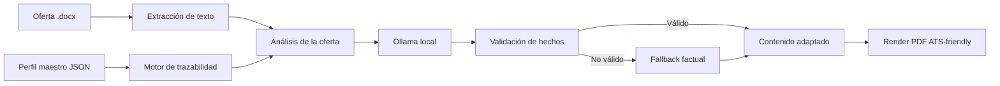

# CV Dinámico con IA Local

Generador de currículos personalizados por oferta laboral, construido para convertir
una oferta en Word y un perfil profesional maestro en un PDF claro, orientado a ATS y
adaptado al contexto de cada vacante.

> **Personalizar no es inventar.** La oferta decide qué experiencia real destacar;
> el perfil maestro sigue siendo la única fuente autorizada de hechos.


## Qué resuelve

Adaptar manualmente un CV para cada oferta suele producir documentos repetitivos,
desordenados o, peor aún, afirmaciones que el candidato no puede demostrar. Este
proyecto automatiza la adaptación sin perder trazabilidad:

- Lee ofertas laborales en formato `.docx`.
- Analiza cargo, seniority, prioridades y requisitos.
- Compara la oferta contra un perfil maestro estructurado en JSON.
- Prioriza habilidades, proyectos, experiencias y logros relevantes.
- Usa Ollama local para mejorar la redacción y el enfoque del CV.
- Rechaza contenido no respaldado y activa un fallback factual cuando es necesario.
- Genera un PDF profesional con diseño fijo y contenido adaptable.

## Flujo del sistema



## Arquitectura

```text
config/perfil_maestro.json  Fuente única de datos profesionales
ofertas/*.docx              Ofertas que se quieren analizar
src/extraction/             Lectura de documentos Word
src/llm/                    Prompts, Ollama y validación de respuestas
src/matching/               Comparación de requisitos y habilidades
src/validation/             Validación de afirmaciones contra el perfil
src/rendering/              Renderizado del PDF y plantilla visual
src/engine.py               Orquestación del flujo completo
tests/                      Pruebas automatizadas
output/pdf/                 CVs generados
```

## Principio de trazabilidad

El sistema separa tres conceptos:

| Fuente | Puede hacer | No puede hacer |
| --- | --- | --- |
| Perfil maestro | Definir experiencia, herramientas, proyectos, fechas y métricas | Ser alterado por una oferta |
| Oferta laboral | Priorizar énfasis, orden y palabras clave existentes | Convertirse en experiencia del candidato |
| Ollama | Mejorar redacción y adaptar el foco | Inventar cargos, sectores, tecnologías o resultados |

Antes de aceptar una respuesta del modelo se revisa, entre otros aspectos:

- primera persona y tono profesional;
- ausencia de frases meta o referencias al candidato desde fuera;
- coincidencia con la experiencia fuente;
- empresas y organizaciones no inventadas;
- tecnologías y dominios no introducidos desde la oferta;
- uso del pasado para experiencias finalizadas;
- fallback al texto factual del perfil si la respuesta no es confiable.

## Requisitos

- Python 3.13 o compatible.
- Ollama instalado y ejecutándose localmente.
- Modelo `qwen2.5:7b` descargado.

Instalar dependencias:

```powershell
pip install -r requirements.txt
```

Preparar Ollama:

```powershell
ollama pull qwen2.5:7b
ollama serve
```

El proyecto puede configurarse mediante `.env`:

```env
OLLAMA_HOST=http://127.0.0.1:11434
OLLAMA_MODEL=qwen2.5:7b
OLLAMA_TIMEOUT=75
```

## Uso

1. Coloca una o varias ofertas `.docx` en `ofertas/`.
2. Actualiza los datos reales en `config/perfil_maestro.json`.
3. Asegúrate de que Ollama esté ejecutándose.
4. Genera los CVs:

```powershell
python src/engine.py
```

Los archivos se guardan en `output/pdf/`. La salida de consola informa el cargo
detectado, el modelo utilizado, el nivel del rol y los bloques adaptados.

## Pruebas

Ejecutar toda la suite:

```powershell
pytest -q
```

Ejecutar las pruebas rápidas sin el caso de generación batch contra Ollama:

```powershell
pytest -q -k "not test_generate_all_cv_for_offers_processes_batch"
```

## Privacidad y diseño

La inferencia se ejecuta con Ollama en el equipo local. El motor envía al modelo
texto extraído de la oferta y el perfil maestro serializado como JSON; no envía
archivos Word, PDFs ni fotografías al servicio de un proveedor externo.

La plantilla visual del CV permanece estable para que cada oferta cambie el contenido
y el énfasis, no la identidad del documento. El resultado conserva una estructura de
dos columnas, secciones legibles y un formato adecuado para revisión humana y ATS.

## Estado del proyecto

Proyecto personal funcional para generación de CVs dinámicos con IA local. Las áreas
principales de evolución son mejorar la evaluación semántica de requisitos, ampliar
la cobertura de pruebas de generación y añadir una interfaz de usuario para ejecutar
el flujo sin comandos.
