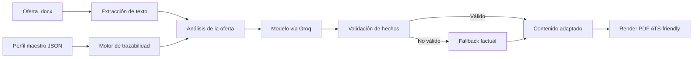

# CV Dinámico con IA

Generador de currículos personalizados por oferta laboral, construido para convertir
una oferta en Word y un perfil profesional maestro en un PDF claro, orientado a ATS y
adaptado al contexto de cada vacante.

> **Personalizar no es inventar.** La oferta decide qué experiencia real destacar;
> el perfil maestro sigue siendo la única fuente autorizada de hechos.


## Qué resuelve

Adaptar manualmente un CV para cada oferta suele producir documentos repetitivos,
desordenados o, peor aún, afirmaciones que el candidato no puede demostrar. Este
proyecto automatiza la adaptación sin perder trazabilidad:

- Lee ofertas laborales en formato `.docx`.
- Analiza cargo, seniority, prioridades y requisitos.
- Compara la oferta contra un perfil maestro estructurado en JSON.
- Prioriza habilidades, proyectos, experiencias y logros relevantes.
- Usa un modelo de lenguaje vía la API de Groq para mejorar la redacción y el enfoque del CV.
- Rechaza contenido no respaldado y activa un fallback factual cuando es necesario.
- Genera un PDF profesional con diseño fijo y contenido adaptable.

## Flujo del sistema



## Arquitectura

```text
config/perfil_maestro.json  Fuente única de datos profesionales
ofertas/*.docx              Ofertas que se quieren analizar
src/extraction/             Lectura de documentos Word
src/llm/client.py           Cliente de la API de Groq (reintentos, errores sin la clave)
src/llm/llm.py              Prompts, reglas de veracidad y validación de respuestas
src/matching/               Comparación de requisitos y habilidades
src/validation/             Validación de afirmaciones contra el perfil
src/rendering/              Renderizado del PDF y plantilla visual
src/engine.py               Orquestación del flujo completo
tests/                      Pruebas automatizadas
output/pdf/                 CVs generados
```

## Principio de trazabilidad

El sistema separa tres conceptos:

| Fuente | Puede hacer | No puede hacer |
| --- | --- | --- |
| Perfil maestro | Definir experiencia, herramientas, proyectos, fechas y métricas | Ser alterado por una oferta |
| Oferta laboral | Priorizar énfasis, orden y palabras clave existentes | Convertirse en experiencia del candidato |
| Modelo de lenguaje | Mejorar redacción y adaptar el foco | Inventar cargos, sectores, tecnologías o resultados |

Antes de aceptar una respuesta del modelo se revisa, entre otros aspectos:

- primera persona y tono profesional;
- ausencia de frases meta o referencias al candidato desde fuera;
- coincidencia con la experiencia fuente;
- empresas y organizaciones no inventadas;
- tecnologías y dominios no introducidos desde la oferta;
- uso del pasado para experiencias finalizadas;
- fallback al texto factual del perfil si la respuesta no es confiable.

## Requisitos

- Python 3.13 o compatible.
- Una clave de API de Groq ([console.groq.com/keys](https://console.groq.com/keys)). El plan
  gratuito alcanza para uso personal (8.000 tokens por minuto y 200.000 por día).

Instalar dependencias:

```powershell
pip install -r requirements.txt
```

Copia `.env.example` como `.env` y escribe tu clave en `APY_KEY`. Variables opcionales:

| Variable | Uso |
| --- | --- |
| `GROQ_MODEL` | Modelo de Groq. Si no se define, se usa el valor por defecto de `src/llm/client.py`. |
| `GROQ_TIMEOUT` | Segundos de espera por respuesta (por defecto 60). |
| `GROQ_REASONING_EFFORT` | Esfuerzo de razonamiento (`low`, `medium` o `high`; por defecto el de `src/llm/client.py`). Vacía si el modelo no razona. |

Cada oferta usa dos llamadas al modelo (análisis + resumen, y experiencias + habilidades)
y una tercera solo si el resumen no pasa la validación. Ante un límite de uso (HTTP 429)
el cliente espera lo que indica Groq y reintenta.

## Uso

1. Coloca una o varias ofertas `.docx` en `ofertas/`.
2. Actualiza los datos reales en `config/perfil_maestro.json`.
3. Verifica que `.env` tenga tu `APY_KEY`.
4. Genera los CVs:

```powershell
python src/engine.py
```

Los archivos se guardan en `output/pdf/`. La salida de consola informa el cargo
detectado, el modelo utilizado, el nivel del rol y los bloques adaptados.

## Pruebas

Ejecutar toda la suite (usa mocks, no llama a la API ni gasta tokens):

```powershell
pytest -q
```

## Privacidad y diseño

La inferencia se ejecuta en los servidores de Groq. El motor envía el texto de la oferta,
las experiencias, las habilidades y la formación del perfil maestro. De los datos personales
solo se envían `profesion` y `profesiones`: nunca nombre, teléfono, correo, ciudad, LinkedIn,
GitHub ni foto, y tampoco archivos Word ni PDF. La clave de API solo viaja en el header de
autorización y no aparece en registros ni mensajes de error.

La plantilla visual del CV permanece estable para que cada oferta cambie el contenido
y el énfasis, no la identidad del documento. El resultado conserva una estructura de
dos columnas, secciones legibles y un formato adecuado para revisión humana y ATS.

## Estado del proyecto

Proyecto personal funcional para generación de CVs dinámicos con IA. Las áreas
principales de evolución son mejorar la evaluación semántica de requisitos, ampliar
la cobertura de pruebas de generación y añadir una interfaz de usuario para ejecutar
el flujo sin comandos.
